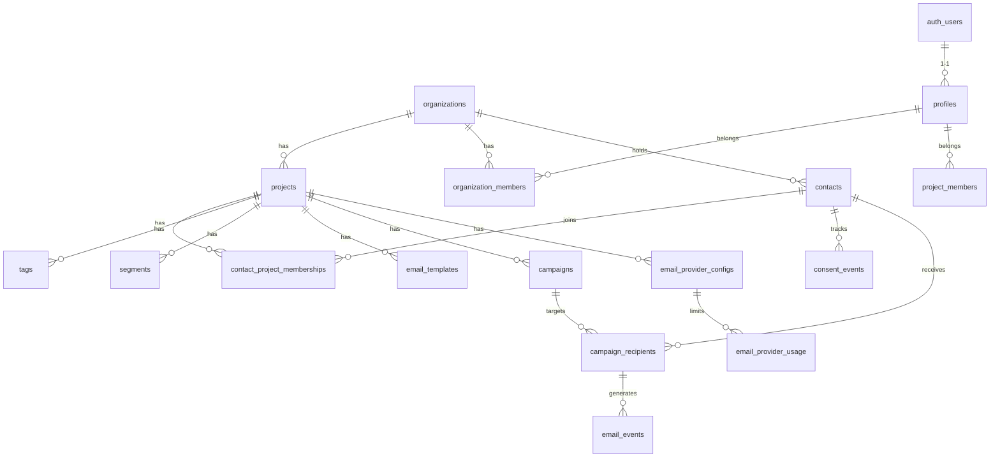

# Database Entity-Relationship Diagram (ERD)

## 1. Sơ đồ Mermaid
*(Bạn có thể render sơ đồ này trên GitHub hoặc Mermaid Live)*

## 2. Mô tả các Bảng Chính

- **`organizations`**: `id`, `name`, `created_at`
- **`projects`**: `id`, `org_id`, `name`, `slug`, `sender_email`, `status`
- **`contacts`**: `id`, `org_id`, `normalized_email`, `first_name`, `last_name` (Lưu thông tin định danh toàn cục).
- **`contact_project_memberships`**: `contact_id`, `project_id`, `status` (Active, Unsubscribed, Bounced), `custom_fields` (Lưu thông tin riêng cho từng dự án).
- **`consent_events`**: `id`, `contact_id`, `project_id`, `status` (Opted_in, Out), `evidence`, `ip`, `created_at`.
- **`campaigns`**: `id`, `project_id`, `template_id`, `subject`, `status` (Draft, Queued, Sending, Completed).
- **`campaign_recipients`**: `id`, `campaign_id`, `contact_id`, `status`, `provider_message_id`.
- **`email_events`**: `id`, `campaign_recipient_id`, `event_type` (Delivered, Opened, Clicked), `timestamp`.
- **`email_provider_configs`**: `id`, `project_id`, `provider_type`, `encrypted_credentials`, `monthly_quota`.

## 3. Ràng buộc (Constraints) & Indexes
- **Unique Constraint**: `[org_id, normalized_email]` trên bảng `contacts` để chống trùng email trong cùng tổ chức.
- **Unique Constraint**: `[contact_id, project_id]` trên bảng memberships.
- **Indexes**: 
  - `idx_contacts_normalized_email`
  - `idx_campaign_recipients_status` (để worker tìm batch nhanh).
  - `idx_provider_message_id` (để Webhook map data nhanh).
